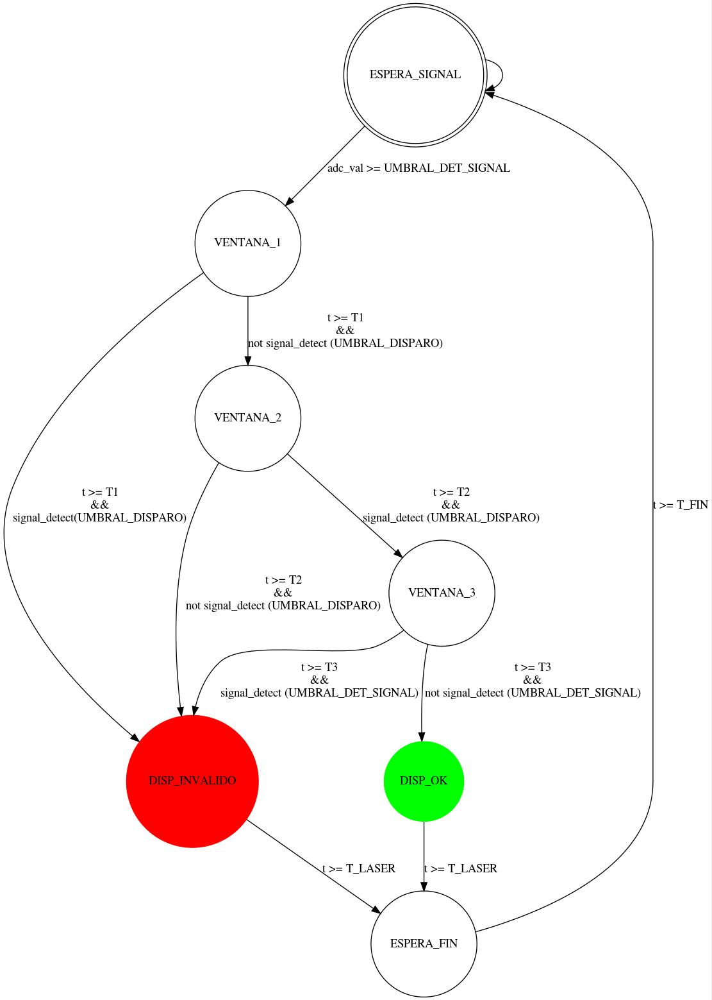

Dispositivo para la detección del disparo de un FAL con un piezoelectrico.
--------------------------------------------------------------------------

En este trabajo se realizaron las siguientes tareas:

* Relevamiento de la señal del piezo, en las condiciones de carga y disparo del FAL, mediante un osciloscopio y su grabacion en formato CSV.

* El desarrollo de un software con interfaz gráfica, en lenguaje C#, 
para simular las señales del piezo en la carga y disparo del FAL.
Este software permite leer los archivos CSV generados por el osciloscopio, y transmitir esa informacion, mediante una comunicación serie, a un Arduino para su procesamiento (en modo simulación).    

* El desarrollo del firmware para un Arduino que permite analizar la señal que llega del piezo, a través del puerto ADC, y detectar cuando se produce eldisparo del FAL.
El firmware también posee un modo simulación donde obtiene la informacion de la señal por el puerto serie.  

* Diseño en CAD del contenedor del dispositivo y su impresión en 3D

Maquina de estados para la deteccion de la señal de disparo
-----------------------------------------------------------

* Diseño del PCB

